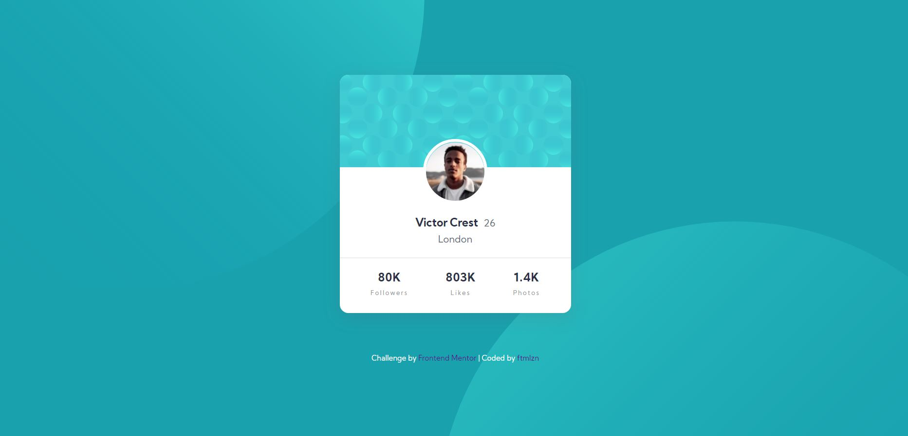

# Frontend Mentor - Profile Card Component Solution

This is a solution to the [Profile card component challenge on Frontend Mentor](https://www.frontendmentor.io/challenges/profile-card-component-cfArpWshJ). Frontend Mentor challenges help you improve your coding skills by building realistic projects.

## Table of Contents

- [Overview](#overview)
  - [The Challenge](#the-challenge)
  - [Screenshot](#screenshot)
  - [Links](#links)
- [My Process](#my-process)
  - [Built with](#built-with)
  - [What I learned](#what-i-learned)
  - [Continued development](#continued-development)
  - [Useful resources](#useful-resources)
- [Author](#author)

## Overview

### The Challenge

Users should be able to:

- Build out the project to the designs provided

### Screenshot

## Links

- Solution URL: [https://fatimalazan.github.io/frontend-mentor-profile-card-component/](https://fatimalazan.github.io/frontend-mentor-profile-card-component/)
- Live Site URL: [https://fatimalazan.github.io/frontend-mentor-profile-card-component/](https://fatimalazan.github.io/frontend-mentor-profile-card-component/)

## My Process

### Built with

- Semantic HTML5 markup
- CSS custom properties
- Flexbox
- BEM

### What I learned

I've learned to apply two background images at the same time using CSS.

### Continued development

I need to understand better the concept of Flexbox since it's really useful for creating layouts. Another thing is, to get better as well in Responsive Web Designing and Media Queries. I also need to get familiarized more with the BEM Methodology to my future challenges and projects.

### Useful Resources

- [A Complete Guide to Flexbox by CSS Tricks](https://css-tricks.com/snippets/css/a-guide-to-flexbox/)
- [Line-clamp CSS Guide](https://mgearon.com/css/line-clamp-css-guide/)
- [How to Use BEM Methodology](https://www.toptal.com/css/introduction-to-bem-methodology)
- [CSS Basics: Using Multiple Backgrounds](https://css-tricks.com/css-basics-using-multiple-backgrounds/)

## Author

- Fatima Lazan
- Frontend Mentor - [@fatimalazan](https://www.frontendmentor.io/profile/fatimalazan)
